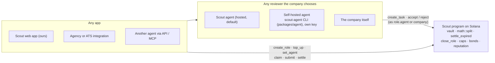

# Scout

**A company gives an AI agent a role and a budget. The agent runs hiring end to end and rents humans for the parts it can't do: it posts small paid gigs (find candidates, a 30-minute screening call, a language check, a reference check), checks the work, and pays recruiters from the budget on Solana.**

Built for HackYeah 2026, Superteam Poland challenge "Finance Without Intermediaries". The program is live on Solana devnet. The product name lives in one constant, `PROJECT_NAME` in `packages/shared/src/constants.ts`.

## Why

- Agencies cost ~20% of a salary, paid only on hire. Without one, the founder searches alone in the evenings.
- The human part of recruiting is often done on spec. Freelance screeners are typically paid only through a share of the success fee if a candidate is eventually hired, months later, so most calls are never paid (our hypothesis, from our recruiting-agency design partner). Screeners want steady income, not a lottery.
- Scout pays per accepted piece of work, in seconds, to recruiters in any country.

## Scout is a protocol

Scout is **an on-chain program plus an open agent API**. Our hosted agent and this app are one implementation of it.



Three layers, kept apart on purpose:

- **(a) Money and payout rules are enforced by the program. No intermediary.**
  - custody in a PDA vault (`create_role`);
  - the exact split (`math::split` via `payout::pay_out`);
  - permissionless `settle_expired` and `release_holdback`;
  - `close_role` refunds;
  - `SelfDealing` and `subject_scout` (separation of duties);
  - bonds;
  - company-signed agent caps (`agent_max_bounty`, `agent_max_commitment`).
- **(b) Judgement (accept or reject) is done by a reviewer the company chooses.** It can be our Scout agent (the default), its own self-hosted agent (`scout-agent` CLI in `packages/agent`, its own key as the on-chain gatekeeper, remote ports over the `agent.*` API) or the company itself.
  - The gatekeeper is the agent or the company (program v3.3, live).
  - The company can switch at any time with `set_agent`.
  - Accept carries a `review_hash` and reject a `reason_hash` on-chain (v3.3, live). Appeals are live: `submissions.appeal` → the company's `decideAppeal`; an overturn pays the recruiter directly.
- **(c) What still depends on us today:**
  - **our reference implementation's availability**, which is service, not custody: funds stay in the vault and pending work settles without us;
  - **the program's upgrade key.** A multisig and then immutability are on the roadmap.

## How it works

1. **The company funds a role once.** `create_role` moves the budget into a vault owned by a program PDA and names the role's **agent**. The company also signs the agent's spending caps.
2. **The agent posts gigs.** `create_task` is signed by the agent. Prices come from `GIG_PRICES` in `backend/src/agent/gigs/market.ts`:
   - sourcing: $12 base × seniority (senior ≈ $20–25), paid when the candidate confirms,
   - screening call: $40,
   - tech screen: $100,
   - language check: $15,
   - reference check: $25.
3. **Recruiters claim and deliver.**
   - `claim_task` is for exclusive gigs and can be gated by reputation.
   - `submit_deliverable` carries a deliverable hash and an evidence hash (for example the hash of a recorded call transcript).
   - The recruiter who sourced a candidate can't take that candidate's screening.
   - Recruiters without an operator post a small bond.
4. **The agent checks the work and pays** with `accept_submission`, signed by the agent.
   - Sourcing is paid only after the candidate confirms interest through a link (`/c/<token>`, with a Memo proof on the accept transaction).
   - Screenings are checked against the agent's question script and the recorded transcript.
   - The payout split (`math::split`):
     - 10% platform fee;
     - 10% to the vouching operator, if any;
     - 30% of the recruiter's share held back until the candidate reaches the company (`attest_outcome`) or the window ends (`release_holdback`).
5. **The company keeps the hiring decisions.** It reviews the shortlist and invites people to interviews. "Came to the interview" releases the held-back parts.

Exact demo payouts are in [docs/demo-script.md](docs/demo-script.md).

## Instructions and who can call them

From `programs/scout/src/instructions`. On every instruction the payer is our relayer: it pays fees and rent and has no authority.

| Instruction | Signer(s) | What it does |
|---|---|---|
| `initialize_config` | admin (must be the program's upgrade authority) | Sets fee, treasury and mint, once |
| `update_config` | admin | Rotates the treasury, changes the fee within bounds, for new roles |
| `create_role` | company | Creates the vault, names the agent, deposits the budget |
| `top_up` | company | Adds budget |
| `set_agent` | company | Revokes or rotates the agent and its caps |
| `create_task` | company or agent | Posts a gig: type, bounty, slots, exclusivity, holdback, `subject_scout`, `min_accepted`, `bond_bps` |
| `claim_task` | recruiter, with the gatekeeper (agent or company) | Takes an exclusive gig |
| `release_claim` | the claimant any time; company or agent after the claim timeout | Frees a claimed gig |
| `close_task` | company or agent | Closes a gig |
| `register_operator` | operator authority | Registers a recruiter school or agency and its fee |
| `register_scout` | recruiter, plus the operator to vouch | Creates the recruiter's on-chain profile |
| `submit_deliverable` | recruiter, with the gatekeeper (agent or company) | Delivers work. Posts the bond if unvouched. Rejects self-dealing and self-review |
| `accept_submission` | company or agent | Pays out per `math::split`, refunds the bond, records `review_hash`. The program doesn't check a candidate confirmation here: our agent accepts a sourced candidate only after the candidate confirms (backend policy, `confirmations.ts`) |
| `reject_submission` | company or agent | No payout; the bond stays in the company's budget; `reason_hash` on-chain; rent returned to the payer |
| `settle_expired` | anyone (non-sourcing); attestor or company (sourcing) | After the review window, pays as if accepted |
| `attest_outcome` | company or agent | `Advanced` releases the holdback. `Fabricated` refunds it and flags the recruiter |
| `release_holdback` | anyone | After the holdback window, pays the held part |
| `close_role` | company | Refunds the rest and closes the vault (nothing pending, nothing held) |

Full interface: [docs/program-interface.md](docs/program-interface.md). Everything in this table is live on devnet, v3.3, [upgrade tx](https://solscan.io/tx/Jbbm8wdm9xixPncFTcbqcVceffA8vwioPRPW2pZtydeHkg7e9A8UcPA5HvFpN5ruDEpPVCQjKwC5DiGLCcr7eMq?cluster=devnet). What depends on whom: [docs/security.md](docs/security.md) §0.

**Sourcing liveness trade-off (honest):**
- What the program enforces for sourcing is only on the *silent* path below. An explicit `accept_submission` by the agent or the company needs no attestor: "the candidate confirmed first" is our agent's policy, not a program rule, so a different agent implementation could accept without it.
- A silent *sourcing* deliverable is **not** paid by anyone after the window. Only the task's `confirmation_attestor` (any key, by default the role's agent) or the company can settle it, because the payment depends on the candidate's confirmation.
- So if the attestor disappears, a sourcing payout waits for the company. That is a liveness dependency, not custody: the money stays reserved in the vault, and the company can always settle or close.
- Non-sourcing deliverables (screening, language, reference) remain permissionlessly settleable after the review window. The flip side: an *unrecorded* (self-reported) call that the candidate never confirmed could be settled by anyone if our agent is down past the window, even though our backend refuses to settle it (`NOT_CONFIRMED`). Giving call tasks the same attestor rule as sourcing would close this; it's on the roadmap. See `docs/jury-qa.md` §10.


## The judges' five questions

**1. Where exactly in the code does the intermediary disappear?**
- `programs/scout/src/instructions/accept_submission.rs` → `payout.rs::pay_out` → `math.rs::split`. One transaction pays the recruiter, the operator and the treasury from a vault owned by a PDA, and parks the holdback.
- `settle_expired.rs::handle_settle_expired` does the same with no signer at all once the review window has passed.
- `create_task.rs` enforces the company-signed agent caps (`agent_max_bounty`, `agent_max_commitment`).
- `invariants.rs::check_role` / `check_task` assert after every budget change that the vault covers everything it owes.

**2. What if a party disappears mid-transaction?**
- **The company goes silent:** a delivered piece of work is paid by `settle_expired` (anyone can call it), and held-back parts by `release_holdback` (anyone).
- **The recruiter goes silent:** nothing is owed. `release_claim` frees an exclusive gig after the claim timeout.
- **We (the platform) disappear:**
  - Funds stay in the vault.
  - Pending deliverables settle permissionlessly after the window, held-back parts release after theirs.
  - The company closes the role with `close_role` and gets the rest back.
  - New deliverables stop, because the gatekeeper co-signature (our agent) is gone. That is a loss of service, not of money; with `set_agent` the company can name its own agent, or none and gate the role itself.

**3. Who can do what? Can the author change anything after deployment?** See the table below and `docs/security.md`.
- The fee is snapshotted per role.
- `update_config` (admin) can rotate the treasury and change the fee within bounds, for new roles only.
- **The real power we keep is the program's upgrade authority** (a cold key, not on the server). A multisig and then immutability are on the roadmap.

**4. Why blockchain and not a database?**
- The budget is held by the program, not by us.
- Payment is atomic with acceptance.
- Silence can't block payment (`settle_expired`).
- The company can fire our agent without asking us.
- Payouts reach recruiters in any country in seconds.
- Reputation belongs to the recruiter.
- A database run by us would make us the intermediary again.

**5. What next week?** See "Next" below.

**Did the backend become the intermediary?** No. The backend is one reviewer implementation (see "Scout is a protocol").
- **What our hosted agent decides:** quality, as the company's chosen delegate, within the company's caps. The company can replace it with its own agent or review itself.
- **What the program enforces regardless of us:**
  - custody in the vault;
  - the caps;
  - the exact split;
  - holdback, bonds and separation of duties;
  - permissionless settlement (non-sourcing; sourcing waits for the confirmation attestor or the company);
  - refunds;
  - the company's right to revoke the agent.
- **Where the gap is:** a dishonest agent could reject good work. The company can replace it, and every rejection is an on-chain event with a reason.

## What the platform can and cannot do

**It cannot:**
- move funds outside these rules;
- pay itself or the company through a gig (`SelfDealing`);
- pay someone who didn't deliver;
- change the fee of a running role, because the fee is snapshotted at `create_role`.

**It can, today:**
- operate the agent that decides payouts within each role's open gigs;
- upgrade the program, because it holds the upgrade authority on devnet.

**Since v3.2/v3.3 (live):** company-signed agent caps, `set_agent` revocation, gatekeeper = agent or company, a separate relayer key (fee payer only) and a separate cold upgrade key. A multisig, then immutability, is on the roadmap.

Further reading:
- details, invariants and the rounding policy: [docs/security.md](docs/security.md)
- hard questions with honest answers: [docs/jury-qa.md](docs/jury-qa.md)
- legal position (not legal advice): [docs/legal.md](docs/legal.md)

## AI with a human in the loop

- **Stack:** the agent (`backend/src/agent`) runs on the Vercel AI SDK with cheap OpenRouter models, plus Jev for per-criterion scoring.
- **What it does:** plans gigs, writes the question scripts, reviews deliverables and answers the company in chat.
- **How payouts are decided:**
  - Money decisions are computed by code from structured scores (`agentDecision`). The LLM never decides a payout by reading free text, and deliverable text is treated as data.
  - The agent rejects low-quality deliverables automatically, always with a reason the company can see.
- **What stays with people:** inviting candidates to interviews and hiring.

## Repository layout

| Path | What |
|---|---|
| `programs/scout/` | Anchor program: instructions, `math.rs` (payout split, proptests), `invariants.rs` |
| `tests/scout.ts` | Program tests on Surfpool (`anchor test`) |
| `packages/shared/` | zod contract, constants, generated program client (`@scout/shared/program`) |
| `backend/` | Fastify + tRPC API, Drizzle/Postgres, relayer, event indexer, the AI agent (`src/agent`), Recall notetaker (`src/recall`) |
| `app/` | React + Vite, shadcn/ui (Base UI), TanStack Router/Query, Privy login |
| `scripts/` | Devnet setup, wallet funding, demo reset, CLI end-to-end |
| `docs/` | Interface, security, demo script, jury Q&A, legal, strategy |

## Run it

Prerequisites: Node 24, pnpm, the Solana toolchain (Rust, Solana CLI, Anchor 1.1, Surfpool), and Docker (optional; without it the backend uses PGlite).

```bash
pnpm install
cp backend/.env.example backend/.env   # OPENROUTER_API_KEY, RPC_URL (a dedicated devnet RPC is recommended)
cp app/.env.example app/.env           # VITE_PRIVY_APP_ID, or demo-mode keys
pnpm db:up && pnpm seed --reset
pnpm dev                               # API on :8788, app on http://localhost:5173
```

- Demo accounts without Google: http://localhost:5173/?auth=demo
- Offline UI: add `&data=mock`

```bash
pnpm build                      # anchor build + regenerate the TS client
anchor test                     # program tests on a local Surfpool
pnpm setup:devnet               # mock USDC mint + Config, writes deployments/devnet.json
SCOUT_KEYPAIR=/tmp/s.json VOUCH=1 CLUSTER=devnet pnpm e2e  # CLI end-to-end with a throwaway vouched scout:
                                # company funds a role for the agent; agent posts a sourcing gig and an
                                # exclusive screening gig, accepts both; company attests Advanced
CLUSTER=devnet pnpm reset:demo  # before a demo: fresh scout wallets (Ola re-vouched), company back to 1000 USDC
pnpm --filter @scout/backend agent run   # the agent on the demo role with simulated recruiters
```

## Devnet deployment

`deployments/devnet.json` is the source of truth.

| | Address |
|---|---|
| Program | [`CmdM2WPuZ6ZrwDXP7DtzfBfR4LMocHs9tqNpGB7JCTo2`](https://solscan.io/account/CmdM2WPuZ6ZrwDXP7DtzfBfR4LMocHs9tqNpGB7JCTo2?cluster=devnet) |
| Mock USDC mint (6 decimals) | `2bK9qWsavQ7KYRPgaurwkfcaVAQkDFx4UA3dd7fVi7vm` |
| Config (v2) | `CoJLM9BvicaPtUT6QPCN5qu2JASYWSpgsJV5Jf7cZ9rY` |
| Relayer (fee payer, `relayer.json`) | `GsaEBURHsvf8FYRPjHNaT2UpDZ7VppTnB2oroH88bfbm` |
| Treasury (`treasury.json`) | `E42pLs7vGq8q5SvpaKLUaeyZLmZJXqH9zFSuNGxgw1JH` |
| Upgrade authority and Config admin (cold, `upgrade-authority.json`) | `EJRLKuFkSQtbtb6sVyEBDNniQUKrPkFpTGJDyLdQq8qC` |
| Deployer (pays upgrade buffers, mock-USDC mint authority) | `8VJdBDpp55sENHDpQjJaGdWXBFQwnZ28KZ6cf5SQBv1f` |
| Demo operator (Operator PDA) | `7278oid4wX7V7bNvtsKngBGksuUPzHngqrKh7erqtUoh` |

Demo wallets (devnet only, keys in `~/.config/solana/superrecruiter/`, never committed):

| Role | Keypair | Address |
|---|---|---|
| Company | `client.json` | `2XtdaRgpB4W9PXRQZRuPYiM67iH8fVq9bhwZ6nhAdv3v` |
| Scout (Ola, vouched by the operator) | `recruiter.json` | `DJBv8s5VMVH5w6sW3s1u2pZCEHYDT9NkuYyKvrBwGuvi` |
| Second scout | `scout2.json` | `29Bwe4RdtvjZmzN8c2GYG5Cs1ZDD1LGEP9BHDE35o1PE` |
| Operator authority (Kraków Recruiting Academy, 10%) | `operator.json` | `DaCdXnaJmS5JHcijS6BGaGbMdMC8rXKhozXzNhFWBArj` |
| AI agent (`role.agent`: posts gigs, accepts deliverables; no SOL, the relayer pays) | `agent.json` | `A3WfA3F7m7tgUNxVQowwBhZFXmUAj1K5329WWv4v3y9r` |

The scout keypairs rotate on every `reset:demo`. Back up the program keypair `target/deploy/scout-keypair.json` (git-ignored); without it the program can't be upgraded at the same address.

## Next

- **More gigs:**
  - warm intros paid on the candidate's confirmed "yes",
  - take-home reviews,
  - employment verification,
  - interview coordination,
  - 30/90-day check-ins.
- **Optional hire bonus** on top of per-call pay: steady income first, upside as an option.
- **Idle budgets that earn while waiting** (Kamino or yield-bearing dollars), opt-in.
- **Key hardening:** a multisig upgrade authority and per-role agent keys.
- **An MCP server** so other agents can post gigs to the same program.
