# The hiring process as paid tasks

RentRecruiter doesn't try to automate a whole hire. It splits the process into **tasks**. The AI agent does the ones it can do cheaply and reliably. For the rest it **posts a paid task to a human recruiter**, and the payment rules for that task run in a Solana program. Each task has a clear unit of work, an acceptance criterion and a price, and that is what makes it payable without an intermediary.

We optimize tasks, not the hire. A task can be verified within hours or days, whereas "the hire" only resolves after months.

## Map

```mermaid
flowchart LR
  A[Intake<br/>AI] --> B[Criteria<br/>AI]
  B --> C[SOURCING<br/>human task]
  C --> D[Outreach<br/>AI + human task]
  D --> E[SCREENING_CALL<br/>human task]
  E --> F[Assessment<br/>AI]
  F --> G[Client interviews<br/>client]
  G --> H[REFERENCE_CHECK<br/>human task]
  H --> I[Offer & close<br/>client + AI]
  I --> J[CHECK_IN<br/>human task]
  classDef human fill:#1F56D6,color:#fff,stroke:#1F56D6;
  classDef ai fill:#eef2fb,color:#1a1a1a,stroke:#c9d3ee;
  class C,E,H,J human;
  class A,B,F ai;
```

Simplified for a slide: **AI defines → humans find → humans talk → AI assesses → client decides.** Every blue box is paid instantly on acceptance.

## Step by step

Prices follow the agent's price sheet (`GIG_PRICES`, senior level), anchored in market rates. Freelance recruiters on Upwork charge **$25–75/h**, and US recruiters **$50–150/h** ([Upwork](https://www.upwork.com/hire/recruiting-assistants/cost/)). A 30-minute screen takes about 45–60 minutes of work including prep and the write-up.

| # | Step | Who | Task type | Unit of work | Accepted when | Price per task (est.) | Status |
|---|---|---|---|---|---|---|---|
| 1 | Intake | AI agent | none | Job description → role summary | The company confirms it | AI cost <$0.05 | **Live** |
| 2 | Criteria and budget | AI agent | none | Weighted must-have / nice-to-have / deal-breaker list, price per task | The company publishes and funds the role | AI cost <$0.05 | **Live** |
| 3 | Sourcing | Human recruiter | `SOURCING` | One qualified candidate (profile + notes) who confirms interest via a link | The agent pre-accepts, the candidate confirms (in progress), the agent accepts | **$12 base × seniority** (senior ≈ $20–25) | **Live on devnet** |
| 4 | Outreach | AI drafts, human sends from their own network | `OUTREACH` (roadmap) | A reply from a target profile | A reply is logged | $3–8 per reply | Roadmap |
| 5 | Screening call | Human recruiter | `SCREENING_CALL` | A 30-min structured call, answers to the agent's question script, recording or notes | The recorded transcript covers the agent's script; the screener is not the sourcer; the agent accepts | **$40** (language check $15; tech screen $100) | **Live on devnet.** The wedge: agencies' freelance networks already run these calls on spec |
| 6 | Assessment | AI agent | none | Per-criterion verdicts with quoted evidence, score 0–100 | Always produced; a human decides | ~$0.001 (Jev) | **Live** |
| 7 | Client interviews | Client; AI schedules | `INTERVIEW_COORDINATION` (roadmap) | Interview booked and attended | Calendar event confirmed | $5–10 | Roadmap |
| 8 | References | Human recruiter | `REFERENCE_CHECK` | A reference call with a structured form | Form complete, the agent accepts | $25 | **Live on devnet** |
| 9 | Offer and close | Client, with AI support | `HIRE_BONUS` (roadmap) | Signed offer | ATS webhook or the company confirms | A bonus from the same vault, set by the company | Roadmap |
| 10 | Onboarding check-in | Human recruiter | `CHECK_IN` | A 30/90-day check-in call | Notes submitted | $15–25 | Roadmap |

## Why SOURCING and SCREENING_CALL first

- **Clear acceptance.** "A qualified, interested candidate" and "a complete structured screen" can be judged by the agent and confirmed by a person within hours. That fits a review window and "silence = acceptance".
- **Frequent.** One hire needs many of them. Gem's benchmarks show only about **8%** of applicants pass the first screen, and tech hires take about **36 interviews per hire** ([Gem 2025 Recruiting Benchmarks](https://lp.gem.com/rs/972-IVV-330/images/2025%20Recruiting%20Benchmarks%20-%20Gem.pdf?version=0)).
- **Real demand on day one.** Agencies run a 30-minute screen before every client submission; our design partner's freelance network does this on spec today. As a task, the agent posts it to any recruiter and pays on completion.

## How the program changes per task type

The program is already task-agnostic: a `RoleVault` holds the budget and each `Submission` is one unit of work. To add a task type we need:

1. a `task_type` on the RoleVault. It already exists in the off-chain model, and on-chain it would take an enum byte;
2. a task-specific acceptance check off-chain. The agent checks that screening notes cover every criterion, then the company decides as it does today;
3. the same payout path: `accept` / `settle_expired` → task price minus fee → recruiter, and fee → treasury.

## Quality, in one paragraph

Each accepted or rejected task updates the recruiter's on-chain `ScoutProfile`. Rejection reasons are coded (`NOT_MATCHING`, `NOT_INTERESTED`, `ALREADY_IN_PIPELINE`). The roadmap includes three more mechanisms:
- per-task-type reputation, so a recruiter can be great at sourcing and new at screening;
- staking or holdbacks for new recruiters;
- client-side ratings of screen quality.

Together these let the system route better tasks to better recruiters. The full reputation design lives in its own document.
