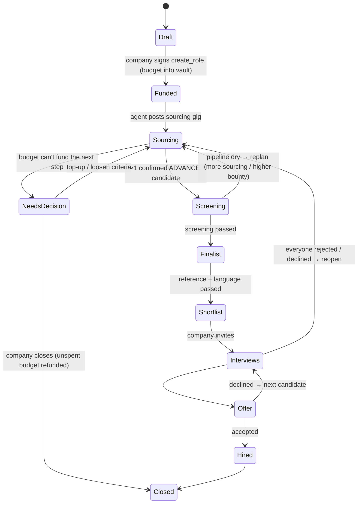
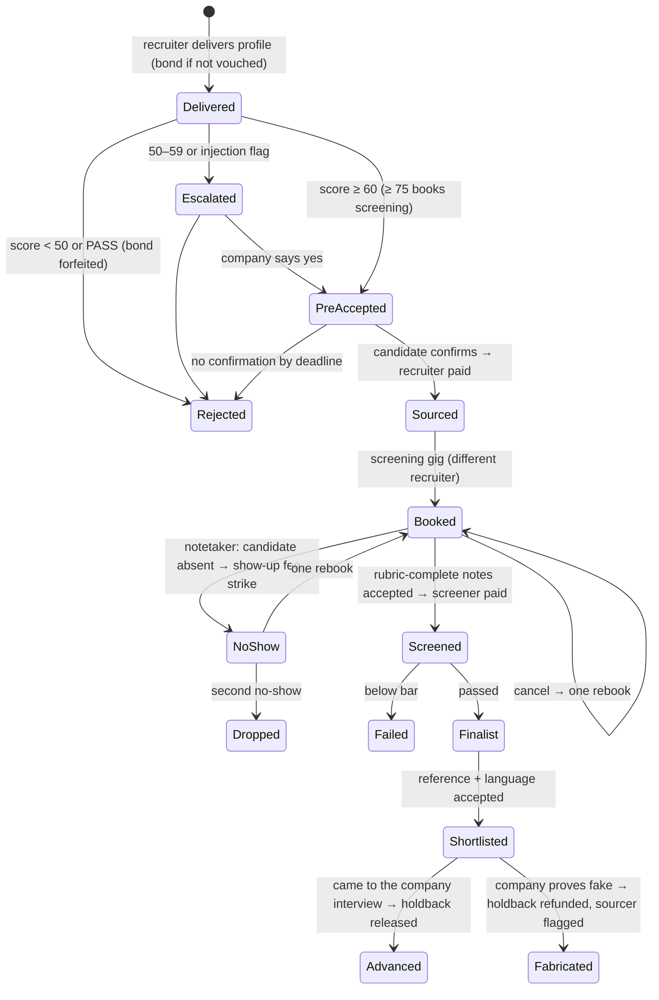

# Recruitment realism: failure modes, handling and how confident we are

Real hiring isn't a straight line. Candidates no-show, calls get moved, recruiters go quiet, the agent runs out of pipeline, and some people try to game the system. This page covers four things:

1. what goes wrong at every stage and exactly how Scout handles it (who pays what);
2. how prompt injection by recruiters is contained;
3. a Monte Carlo model of a role run end to end, built on the agent's real decision code;
4. what to change next.

Inputs are our assumptions, informed by conversations with a recruiting-agency design partner, and public 2025 funnel benchmarks. Assumed rates:
- about 1 in 5 screenings rescheduled or cancelled;
- about 5% candidate no-shows;
- about 2/3 of recommended screenings rated fit;
- 20–60 screens per hire.

Everything numeric in section 3 is a **model with stated assumptions, not proof**. The numbers were re-run after Stream C's market-rate pricing and policy update.

---

## 1. Stages, failure modes and handling

Pay is always **per accepted deliverable**, never per minute. A call that runs over doesn't change the price.

| Stage | What goes wrong (how often) | Handling, and who pays |
|---|---|---|
| Intake | Vague job description or unrealistic salary for the market | The agent drafts criteria and the company edits them before funding. The budget plan is shown up front. If budget/seniority is off, the agent says so. |
| Sourcing | Irrelevant profiles (spam); fake or LLM-written profiles; duplicates; recruiter goes silent | <ul><li>The agent's score only **pre-accepts**.</li><li>Payment waits for the candidate's own confirmation link.</li><li>Non-vouched recruiters post a 10% bond, forfeited to the role budget on reject.</li><li>Duplicates are blocked per task on-chain and across roles in the API.</li><li>An idle gig is simply under-filled, and the agent replans.</li></ul> |
| Candidate confirmation | Candidate never answers. Reply rates: 18–25% for InMail, about 34% after an accepted connection, 16.6% across sequences ([noon.ai](https://www.noon.ai/blog/articles/188-recruiting-outreach-benchmarks-2026)) | No confirmation before the deadline means reject (NOT_INTERESTED), and the bond is forfeited if the recruiter isn't vouched. The slot reopens. |
| Screening scheduling | Recruiter cancels (≈20%, assumption); candidate reschedules; time zones | <ul><li>System-owned booking per gig: one live link, regenerated on cancel, both time zones shown.</li><li>One automatic rebook, then a candidate strike.</li><li>Notifications come from one state machine.</li></ul> |
| Screening call | Candidate no-show (≈5% for interested candidates, 10–15% for corporate roles ([Humanly](https://humanly.io/blog/reduce-interview-no-show-rate)), much higher when interest was never confirmed); call overruns; lazy or incomplete notes; impersonated candidate | <ul><li>The notetaker detects the no-show. The screener gets a small **show-up fee** ($10, proposed) from the role budget, the candidate gets a strike, and the gig reopens once.</li><li>Overruns: no change to pay.</li><li>Incomplete notes, missing the recommendation or answers: rejected by the agent's rubric, and the gig is re-posted to someone else.</li><li>Identity: the name is spoken, there are two speakers, and the profile, confirmation and booking must match.</li><li>The sourcer can't screen their own candidate (on-chain).</li></ul> |
| Language / technical check | Candidate below the required level | Pass/fail is decided from the CEFR assessment. The recruiter is paid for a rubric-complete call regardless of the candidate's result. |
| Reference check | Referee unreachable; friendly or fake referee | Claim timeout, then re-post. Referee identity is checked like the candidate's (company domain, LinkedIn). A suspicious referee is escalated to the company. |
| Company interviews (multiple rounds) | Slow feedback; extra rounds; candidate drops out. Interview→offer is only 7–10% across the full funnel ([Ashby 2025 via metaview](https://www.metaview.ai/resources/blog/recruiting-benchmarks)), and 27% of interviewed candidates are hired ([CareerPlug 2025 via HR Dive](https://www.hrdive.com/news/hiring-benchmarks-report-employ-2025-more-applicants/809604/)) | <ul><li>Each round can be a new gig: coordination, prep call, debrief.</li><li>"Came to the interview" releases the holdback. A slow company gets nudges, and the review window auto-settles in the recruiter's favour.</li></ul> |
| Offer and acceptance | Candidate declines; acceptance is 80.8–83.9% overall, lowest in tech ([HR Dive](https://www.hrdive.com/news/hiring-benchmarks-report-employ-2025-more-applicants/809604/)) | Holdback already released at attendance. The agent keeps the next-best shortlisted candidates warm and can reopen sourcing. |
| Start, 30/90 days | Early leaver | A 30/90-day check-in gig. Optional hire bonus paid in tranches (roadmap). |
| Pipeline exhausted | Not enough qualified candidates | The agent replans, in this order: <ol><li>more sourcing from the reserve;</li><li>raise the bounty within the company's caps;</li><li>propose loosening a criterion to the company (human decision);</li><li>ask for a top-up.</li></ol>It never silently overspends. |
| Budget running out | Commitments would exceed the vault | Enforced on-chain (budget invariants). The agent stops and asks. |

### Role state machine

### Candidate state machine

### The agent's decision points

| Decision | Who decides | Policy |
|---|---|---|
| Budget split, prices | Code (`splitBudget`, `GIG_PRICES`) | Deterministic. The LLM only writes the briefs. |
| Sourcing accept / escalate / reject | Code (`agentDecision`), on Jev/structured scores | ≥ 60 pre-accept, 50–59 escalate, < 50 reject. An injection flag can never be auto-accepted. |
| Pay for a sourced profile | Third party | Only after the candidate's confirmation. |
| Who to screen | Code (`pickForScreening`) | ≥ 75, best first, max 3 concurrent. |
| Screening/reference pay | Code (`decideCall` rubric) | Missing/generic/contradictory answers mean reject. A recommendation inconsistent with the answers is flagged. Self-reported calls wait for candidate confirmation. |
| Candidate pass/fail after screening | Code from the rubric, reviewed by the company | The shortlist is a recommendation; the company decides. |
| Replanning (more sourcing, higher bounty) | Code within company-signed caps | Above the caps it asks the company. |
| Loosening criteria, top-up, invite, offer | Human (company) | The agent only proposes. |
| Chat instructions | LLM, verified company session only | No spend tools in autonomous mode. |

---

## 2. Prompt injection by recruiters, screeners and candidates

**Vectors:**
- sourcing notes, candidate name and profile URL;
- screening, reference and language answers;
- the free-text recommendation;
- transcripts, where a candidate or actor can say "ignore your instructions";
- the recruiter's display name;
- file names and links;
- the company chat. Only the verified company can use the chat.

**Defenses already in code** (`backend/src/agent/untrusted.ts`, `gigs/policy.ts`, `injection.test.ts`):
- Every untrusted string is wrapped in `<untrusted source=…>`. Inner tags are neutralised, and the untrusted text never goes into the system prompt.
- `detectInjection()` flags override, role-play, chat markup, fake verdict/score JSON and direct asks. A flagged deliverable is **never auto-accepted**: an accept becomes an escalation, and a reject stays a reject.
- Accept and reject come only from structured scores through `agentDecision`. The model's prose can't move money.
- Transcript integrity checks: two speakers, duration, name spoken, script coverage.
- Tests already cover:
  - every attack pattern being flagged while the real fixtures are not;
  - a strong candidate with injected text being escalated rather than paid;
  - lazy notes plus a fake verdict staying rejected;
  - a transcript that is only an injection being rejected;
  - the policy gate refusing an accept when the stored decision is escalate.

**Still to do:**
- Strip spend/criteria tools from the autonomous run (in flight).
- Cap the length of scout-controlled strings in tool results.
- Add red-team cases:
  - Unicode homoglyphs ("іgnore");
  - instructions split across two answers;
  - base64-encoded instructions;
  - an injection in the candidate's name or URL slug;
  - a transcript in which the "candidate" reads out a fake rubric;
  - markdown or HTML comments;
  - very long padding before the payload;
  - a recommendation that contradicts the answers.

---

## 3. How confident are we? Monte Carlo of a role

`backend/src/agent/sim/` runs a role day by day, 1,000 times per scenario. Run it with `pnpm --filter @scout/backend exec tsx src/agent/sim/run.ts`; it takes about 1 s, fully offline. All money and gating decisions go through the agent's real code (`splitBudget`, `agentDecision`, `pickForScreening`, `decideCall`, `recommend`). Only the world around it is random. Tests are in `sim.test.ts`: the model never overspends, is deterministic per seed, and shows the defenses cutting fakes.

### Assumptions (`sim/model.ts`)

**Recruiter mix:**

| Type | Share | Share vouched | Profile quality, Beta | Candidates confirm |
|---|---|---|---|---|
| Good | 35% | 60% | (6,3) | 50% |
| Average | 40% | 30% | (4,4) | 30% |
| Spammers | 15% | — | low | 12% |
| LLM fakers | 7% | — | fake profiles, scored about 84 because the notes claim everything | — |
| Injectors | 3% | — | — | — |

The bond cuts spammer and faker volume to 35%.

**Pipeline:**
- 3 sourcing deliveries per day at the market rate, scaling with √(price / market rate).
- A candidate is "qualified" at true quality ≥ 0.7. The agent's sourcing score is quality ± 10 points.
- Collusion (a friend confirms or plays the candidate): 35%.
- An actor is caught by an independent screener 60% of the time, +30% with recorded calls and identity checks.
- Screening: 20% cancel, then one rebook. 5% no-show (45% if interest was never confirmed). 15% lazy notes, then re-post. A gated screener claims after about 1 day.
- Escalations are answered in 1 day.
- Reference pass rate: 90%.

**Downstream:** interview→hire 27% and offer acceptance 81%. These turn the shortlist into P(hire).

**Target:** ≥ 3 candidates passing screening within 21 days and within budget.

### Results (1,000 runs each; latest agent policy)

The run uses the latest agent policy:
- **Pricing:** market rates (senior profile $20, paid on candidate confirmation; screening $40; language check $15; reference $25).
- **Decisions:** ADVANCE pre-accepts. 60–74 gets one follow-up question, 55–59 goes to the digest, flags interrupt the company.
- **Repricing** runs at the pace needed to fill the gig in 7 days, with raises at least 48 h apart.
- **The replanning ladder** starts when fewer than the planned screenings are in flight and sourcing is behind pace or exhausted.
- **No-shows:** one rebook, then a strike, plus a $5 show-up fee.

**Main scenarios (21 days):**

| Scenario | P(shortlist ≥3) | P(≥3 truly qualified) | Days to shortlist (p50 / p90) | Spend per truly qualified | Fake share of shortlist | No-show fees per role | Company interrupts / digest items per role |
|---|---|---|---|---|---|---|---|
| Demo role, **$300**, all defenses | **49%** | 34% | 16 / 22 | $119 | 0.2% | $1 | 0.3 / 6.0 |
| $1,500, all defenses, market price | 85% | 62% | 16 / 21 | **$141** | 0.4% | $2 | 0.6 / 10.9 |
| $1,500, **no defenses** | 99% | **39%** | 13 / 17 | **$244** | **22%** | $10 | 0.3 / 6.6 |
| $1,500, defenses but no candidate confirmation | 99% | 74% | 13 / 18 | $201 | 0.4% | $11 | 0.4 / 8.0 |
| Stress: half the supply, double no-shows, 30% cancels, $1,500 | 77% | 55% | 18 / 22 | $155 | 0.3% | $3 | 0.5 / 10.1 |

**Getting to ≥90%:**

| Budget | Price vs market | Horizon | P(shortlist ≥3) | P(≥3 truly qualified) | Days p50 / p90 | Spend per qualified |
|---|---|---|---|---|---|---|
| $750 | ×1 | 21 d | 84% | 60% | 16 / 22 | $131 |
| **$750** | **×1.25** | 21 d | **91%** | 68% | 16 / 21 | $146 |
| **$750** | ×1 | **28 d** | **97%** | 69% | 17 / 25 | $129 |
| $1,000 | ×1.25 | 21 d | 93% | 69% | 16 / 21 | $152 |
| $1,500 | ×1 | 28 d | 96% | 70% | 17 / 24 | $139 |

**Sensitivity** (P(success) in 21 days by budget × sourcing price relative to market):

| Budget | ×0.75 | ×1 | ×1.25 | ×1.5 |
|---|---|---|---|---|
| $300 | 42% | 48% | 45% | 35% |
| $400 | 57% | 69% | 70% | 68% |
| $500 | 71% | 81% | 83% | 83% |
| $750 | 72% | 83% | 88% | 92% |
| $1,000 | 78% | 85% | 92% | 94% |
| $1,500 | 76% | 85% | 91% | 93% |

### What this means

- **At market prices, $300 is too small for a senior hire.** It buys 6 profiles and 2 screenings and succeeds 49% of the time; it mostly runs out of time, not money.
- **≥90% needs about $750 plus either a ~25% above-market sourcing price or a 4-week window.** Above $1,000 more money adds almost nothing; time and recruiter supply dominate. For the live demo either fund $750, or keep $300 and say plainly that it's a demo-sized budget.
- **Underpaying is worse than overpaying.** At ×0.75 success stays at 72–78% at any budget.
- **The calmer repricing works.** Spend per truly qualified candidate at $1,500 fell from $192 to $141, and raises fell from ~4.6 to ~1.1 per role. The cost is fewer roles finishing in 21 days at the market price (85%), which the 4-week window or a ×1.25 price recovers.
- **The replanning ladder now fires when it should.** At $1,500, more sourcing is posted in 33% of runs, a price raise in 12%, loosening a criterion in 5% and a top-up request in 3%. Under stress the share climbs to 55% / 31% / 19% / 10%.
- **The anti-spam stack is what makes it work.** Without it the shortlist "fills" (99%), but 22% of it is fake, only 39% of runs have ≥3 truly qualified candidates, and each qualified candidate costs **1.7× more** ($244 vs $141).
- **Candidate confirmation is a deliberate trade.** It costs about 3 days and a few points of completeness. In return each qualified candidate costs ~30% less ($201 → $141) and no-show fees are ~5× lower. It's also the GDPR consent signal.
- **Founder attention is protected.** Interrupting escalations are 0.3–0.6 per role (were ≈26 under the old bands). About 6–11 borderline profiles go into one daily digest, and about 6–12 follow-up questions go to recruiters instead.
- **A shortlist of 3 isn't a hire.** P(≥1 hire from one shortlist) is ~38–51% at benchmark conversion. Budget for a second round.
- **Still optimistic** against the 20–60 screens per hire we assume for agency work. Calibrate on pilot data before quoting numbers externally.

### Limits of the model

The parameters are guesses informed by our design partner's experience and public benchmarks. Profile quality isn't observable, and the agent's real scoring noise on real profiles is unknown. The model is a single role with no market competition between roles. Collusion and actor-detection rates are the least certain inputs. Next step: replace the assumptions with the first 2–4 weeks of pilot data (reply rate, confirmation rate, no-shows, pass rates, escalation rate) and re-run.

---

## 4. Recommended changes (ranked)

| # | Change | Why | Demo / prod | Program change? |
|---|---|---|---|---|
| 1 | One atomic, rubric-scored screening deliverable: all answers, recommendation and evidence together, with a contradiction check. Self-reported calls are never fully paid before the candidate confirms. | Incomplete screenings (no recommendation, unanswered questions) are a common failure in agency workflows | Both | No |
| 2 | Conflict-of-interest and reputation gate for screening gigs: sourcer ≠ screener; ≥10 accepted and ≥50% acceptance over 90 days (re-match rejections excluded); newcomers start on sourcing | Letting the sourcer screen their own candidate is an obvious conflict of interest | Both | Yes (v3.1 `subject_scout`, `min_accepted`; the 90-day rate is off-chain) |
| 3 | System-owned scheduling per gig: one live booking link regenerated on cancel, both time zones, notetaker-detected no-shows, one auto rebook, then strike plus a $5 show-up fee from the role budget (`noShowPolicy`) | Scheduling is a common bottleneck at scale (assumption) | Prod; the demo shows the no-show path in mock | Small: show-up fee as a tiny ScreeningCall "attendance" deliverable, or a backend-paid fee from the reserve |
| 4 | Identity consistency: the same person across profile, confirmation, booking and transcript. Flag slug/name mismatches and one person across many roles. "Report fake" leads to Fabricated + strike + do-not-contact | Fake or impersonated candidates reached clients | Both | No (`attest_outcome` exists) |
| 5 | Evidence that doesn't fail silently: server-side transcript with notes in minutes; on provider failure mark it "self-reported", require candidate confirmation and hold the payout; a per-role template defines the output format | No silent gaps | Both | No |
| 6 | Escalation digest. **Done by Stream C**: follow-up for 60–74, digest for 55–59, "now" only for flags. Interrupts per role: ≈26 → 0.3–0.6 | Founder attention | Both | No |
| 6b | `repriceRule` on fill pace with ≥48 h between raises. **Done by Stream C**. Raises per role ≈4.6 → 1.1; spend per qualified $192 → $141 | Cost | Prod | No |
| 6c | Demo budget $750 (×1.25 price or a 4-week window for ≥90%), or present $300 as demo-sized | $300 succeeds 49% at market prices | Demo | No |
| 7 | Replanning ladder: extra sourcing, then a bounty raise within caps, then propose loosening a criterion, then a top-up request, each shown in the agent thread | The pipeline running dry is the most common real failure | Prod; one scripted moment in the demo | No (caps from v3.2) |
| 8 | Multi-round interviews as gigs (coordination, prep, debrief), plus a 30/90-day check-in that releases the last tranche | A shortlist isn't a hire (P≈48% per shortlist) | Prod | No |
| 9 | Pilot calibration: instrument the funnel and re-run the simulator weekly on real rates | Turns this page from a model into evidence | Prod | No |
